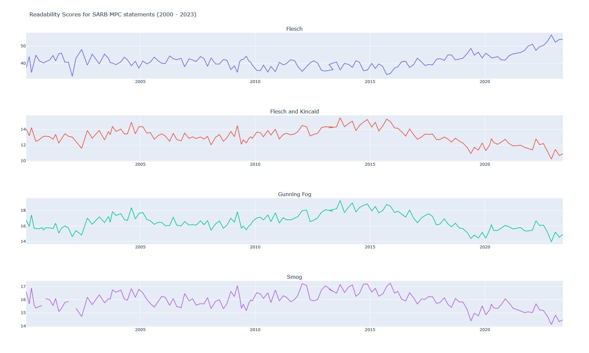
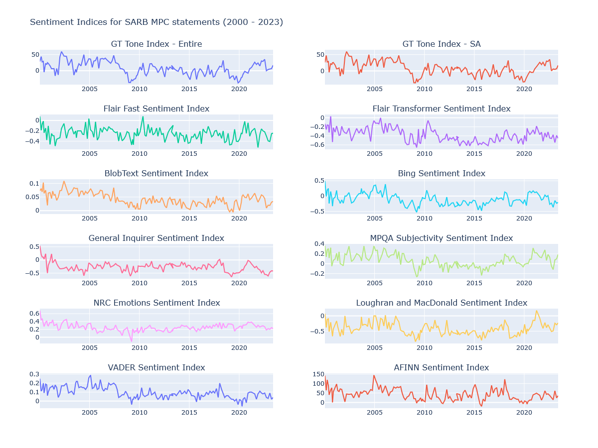
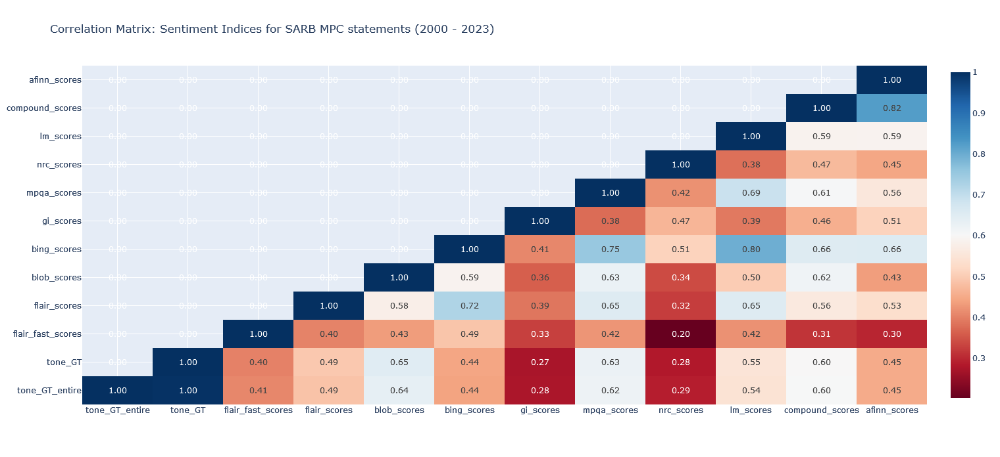

 

# Text Mining SARB Monetary Policy Statements

> The results contained in this repo are preliminary and are subject to change without notice. Please contact me if you want to cite.

Table of Contents
=================

* [Introduction](#introduction)

* [Readability](#readability)

* [Sentiment Indices](#sentiment-indices)

* [Correlation Matrix](#correlation-matrix)

* [Contact](#contact) 

## Introduction

Let's talk about the power of words, especially when they come from central bankers. Why are their words so influential? Well, because they have the ability to move markets. Central bank communication is like a secret weapon in the arsenal of those who have adopted inflation targeting as their monetary policy.

Take the South African Reserve Bank, for example. They jumped on the inflation targeting bandwagon back in 2000, and it has been their go-to policy ever since. But how can we really grasp the impact of their central bank communication over the past 23 years?

Here's where things get interesting. We're not just going to rely on plain old analysis. Oh no! We're diving into the world of computational linguistics techniques to uncover the hidden treasures in the South African Reserve Bank's Monetary Policy Committee Statements. These statements are released after the committee has had intense deliberations for a mere 2 to 3 days to figure out the best stance to keep inflation in check, ideally within that sweet spot of 3% to 6% over the medium term.

So, what are we looking for in these statements? Well, we've got our sights set on two main dimensions: readability and sentiment. Readability tells us how easily regular folks can understand these statements. Are they filled with fancy jargon that only economists can decipher, or are they written in plain English that anyone can grasp?

But that's not all. We're also going to dig into the sentiment expressed in these statements. Are they uplifting and confidence-inspiring, or do they leave us scratching our heads and feeling uncertain?

## Readability

 To assess the readability of the statements, we employ several widely recognized metrics:

 - [x] *The Flesch Readability Index*: This metric quantifies the ease of reading a text by considering factors such as sentence length and syllable count. A higher score indicates greater readability.

 - [x] *The Flesch-Kincaid Grade Level*: Similar to the Flesch Readability Index, this metric determines the grade level required to comprehend a text. A lower grade level indicates higher readability.

 - [x] *The Gunning Fog Index*: This metric focuses on the complexity of sentences and word usage. A lower score suggests greater readability.

 - [x] *The Smog Index*: This metric estimates the years of education required to understand a piece of text. A lower score indicates higher readability.

The graph illustrates the readability measurements obtained using the above metrics.

  

## Sentiment Indices

In our quest to gauge the sentiment expressed within the Monetary Policy Committee (MPC) statements, we employ a range of methods, each with its own strengths and limitations. These methods serve as powerful tools to transform the qualitative nature of the statements into quantitative data, enabling us to conduct insightful time series analyses.

The graph below shows the results from using different methods to measure sentiment in the MPC statements.

  

## Correlation Matrix

Since we have several sentiment indices, we decided to measure the correlation among them. Here are the results. 

  

## Contact 

ntuthuko@zetra.io 